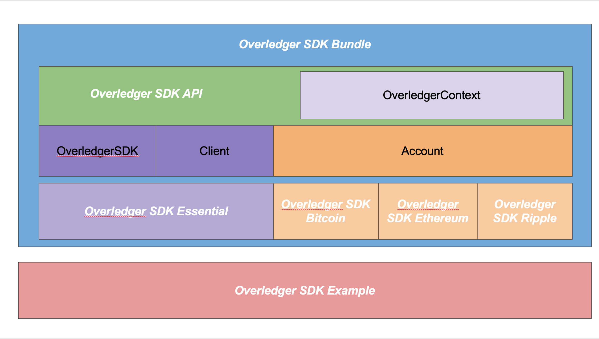
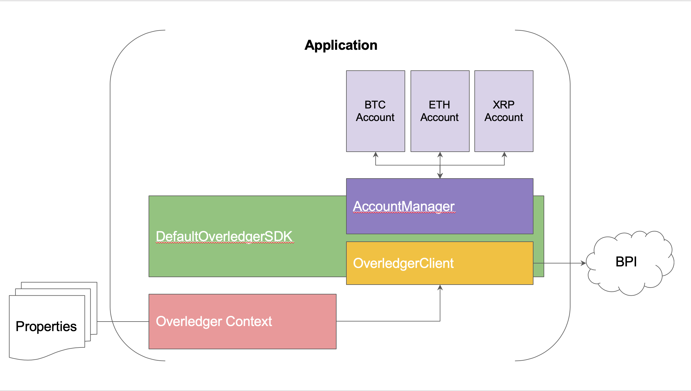

# overledger-sdk-java

Welcome to Overledger Software Development Kit (SDK) for Java project. The SDK helps facilitate Java applications to manage the lifecycle of Overledger BPI layer. The SDK also provides a means to execute transactions to variety of DLTs. Read transactions and monitor block information.

The SDK acts as library for embedding itself in user's application, and helping for execute and access DLT through Overledger BPI.

## IMPORTANT: Usage of SDK
Application using Overledger SDK for Java is required to have Overledger BPI key and Overledger Mapp ID.

## Release notes
|Release   | Notes |
|----------|:-----:|
|1.0.0     | [v1.0.0 release notes](docs/release_v1.0.0_notes.md)|

## Overledger SDK Structure

## Overledger SDK Working Flow

## Overledger SDK Modules

### [overledger-sdk-api](./overledger-sdk-api/README.md)
API module defines Overledger SDK interfaces.

### [overledger-sdk-essential](./overledger-sdk-essential/README.md)
This module gives a basic implementation of Overledger SDK API.

### [overledger-sdk-bitcoin](./overledger-sdk-bitcoin/README.md)
This module contains Bitcoin implementation of Overledger Account API.

### [overledger-sdk-ethereum](./overledger-sdk-ethereum/README.md)
This module contains Ethereum implementation of Overledger Account API.

### [overledger-sdk-ripple](./overledger-sdk-ripple/README.md)
This module contains Ripple implementation of Overledger Account API.